# Refdog

- [Notes](#notes)
- [Diagram](#diagram)
- [Resource _site_](#resource-site)
    - [Site examples](#site-examples)
    - [Site options](#site-options)
    - [Ingress options](#ingress-options)
    - [Console options](#console-options)
    - [Flow collector options](#flow-collector-options)
    - [Router options](#router-options)
    - [Skupper resource options](#skupper-resource-options)
- [Resource _link_](#resource-link)
    - [Link diagram](#link-diagram)
    - [Link examples](#link-examples)
    - [Link options](#link-options)
- [Resource _token_](#resource-token)
    - [Token diagram](#token-diagram)
    - [Token examples](#token-examples)
    - [Token options](#token-options)
- [Resource _provided-service_](#resource-provided-service)
    - [Provided service diagram](#provided-service-diagram)
    - [Provided service examples](#provided-service-examples)
    - [Provided service options](#provided-service-options)
    - [Provided service port options](#provided-service-port-options)
    - [Provided service port TLS options](#provided-service-port-tls-options)
- [Resource _required-service_](#resource-required-service)
    - [Required service diagram](#required-service-diagram)
    - [Required service examples](#required-service-examples)
    - [Required service options](#required-service-options)
    - [Required service port options](#required-service-port-options)
    - [Required service port TLS options](#required-service-port-tls-options)

## Notes

### Goals

*Regularize* and *document* Skupper configuration.

- A declarative language for creating sites, linking sites, and
  exposing services.
- A configuration model that operates uniformly across Kubernetes,
  Podman, and Systemd bundles, while still allowing for platform
  specific variations.
- A central configuration reference for Skupper.

In addition, I'd like to use this exercise to work out what the [CLI
experience][services-cli] should be for provided and required
services.

[services-cli]: services-cli.txt

A related project is mocking up the [GUI equivalent][skuppernetes] in
the context of a Kubernetes console.

[skuppernetes]: https://www.ssorj.net/skuppernetes/

### Resources

- [Hello World expressed in YAML](hello-world.yaml)
- [Hello World as YAML embedded in ConfigMaps](hello-world-config-map.yaml)
- [Hello World scripted using the proposed CLI commands](hello-world-cli-script.txt)
- [Hello World and systemd bundles](hello-world-systemd-bundles.yaml)
- [Skupper KCP demo](https://github.com/grs/skupper-kcp-demo)
- [Skupper syncer demo](https://github.com/grs/skupper-syncer-demo)
- [Kubernetes Service API](https://kubernetes.io/docs/reference/kubernetes-api/service-resources/service-v1/)
- [Skuppernetes, the GUI equivalent of the operations here](https://www.ssorj.net/skuppernetes/)

<h2 id="yo">Diagram</h2>

## Resource _site_

### Site examples

<table>
<tbody>
<tr><th>Skupper YAML</th></tr>
<tr><td><pre>apiVersion: skupper.io/v1alpha1
kind: Site
metadata:
  name: east
  namespace: east
spec:
  ingress: loadbalancer
  enableConsole: true</pre></td></tr>
<tr><th>Skupper CLI</th></tr>
<tr><td><pre>skupper init --site-name east --ingress loadbalancer --enable-console</pre></td></tr>
</tbody>
</table>

<dl>

### Site options

<dl>
<dt>
name
</dt>
<dd>

A name of your choice for the Skupper site.

<b>Type:</b> String

</dd>
<dt>
createNetworkPolicy
</dt>
<dd>

Create network policy to restrict access to Skupper services
exposed through this site to the pods currently in the
namespace.

<b>Type:</b> Boolean

</dd>
</dl>

### Ingress options

<dl>
<dt>
ingress
</dt>
<dd>

Select the method for cluster ingress.  Determines how XXX
is exposed outside of the cluster.

<b>Type:</b> String

<b>Default:</b> route if available, else loadbalancer

<b>Choices:</b> route, loadbalancer, nodeport, nginx-ingress-v1, contour-http-proxy, ingress, none

</dd>
<dt>
ingressHost
</dt>
<dd>

The hostname or alias by which the ingress route or proxy
can be reached.

The host through which the node is accessible when using
nodeport as ingress.

<b>Type:</b> String

</dd>
<dt>
loadBalancerIP
</dt>
<dd>

The load balancer IP address that will be used for XXX, if
supported by the cloud provider.

<b>Type:</b> String

</dd>
<dt>
ingressOptions
</dt>
<dd>

XXX xxxIngress, xxxIngressHost, xxxLoadBalancerIP (console, controller, router)

<b>Type:</b> XXX

</dd>
</dl>

### Console options

<dl>
<dt>
enableConsole
</dt>
<dd>

Enable skupper console must be used in conjunction with
'--enable-flow-collector' flag

<b>Type:</b> Boolean

</dd>
<dt>
consoleAuth
</dt>
<dd>

The user authentication method for the console.

<b>Type:</b> String

<b>Default:</b> internal

<b>Choices:</b> internal, openshift, unsecured

</dd>
<dt>
consoleUser
</dt>
<dd>

The console username when using internal authentication.

<b>Type:</b> String

<b>Default:</b> admin

</dd>
<dt>
consolePassword
</dt>
<dd>

The console password when using internal authentication.

<b>Type:</b> String

<b>Default:</b> [generated]

</dd>
</dl>

### Flow collector options

<dl>
<dt>
enableFlowCollector
</dt>
<dd>

Enable cross-site flow collection for the application network

<b>Type:</b> Boolean

</dd>
<dt>
flowCollectorRecordTTL
</dt>
<dd>

Time after which terminated flow records are deleted,
i.e. those flow records that have an end time set.

<b>Type:</b> Duration

<b>Default:</b> 30m

</dd>
</dl>

### Router options

<dl>
<dt>
routerMode
</dt>
<dd>

The role of the router in the router topology.  Interior
routers do XXX.  Edge routers only do YYY.

<b>Type:</b> String

<b>Default:</b> interior

<b>Choices:</b> interior, edge

</dd>
<dt>
routerLogging
</dt>
<dd>

Logging settings for the router.

<b>Type:</b> String

<b>Default:</b> info

<b>Choices:</b> trace, debug, info, notice, warning, error

</dd>
<dt>
routerDebugMode
</dt>
<dd>

Enable debug mode for the router.

<b>Type:</b> String

<b>Choices:</b> asan, gdb

</dd>
<dt>
routers
</dt>
<dd>

The number of router replicas to start.

<b>Type:</b> Integer

</dd>
</dl>

### Skupper resource options

<dl>
<dt>
resourceRequests
</dt>
<dd>

XXX

<b>Type:</b> XXX

</dd>
<dt>
resourceLimits
</dt>
<dd>

XXX

<b>Type:</b> XXX

</dd>
<dt>
resourceAnnotations
</dt>
<dd>

XXX

<b>Type:</b> XXX

</dd>
<dt>
resourceLabels
</dt>
<dd>

XXX

<b>Type:</b> XXX

</dd>
<dt>
resourceNodeAffinity
</dt>
<dd>

XXX

<b>Type:</b> XXX

</dd>
<dt>
resourcePodAffinity
</dt>
<dd>

XXX

<b>Type:</b> XXX

</dd>
</dl>

</dl>

## Resource _link_

### Link diagram

### Link examples

<table>
<tbody>
<tr><th>Skupper YAML</th></tr>
<tr><td><pre>apiVersion: skupper.io/v1alpha1
kind: Link
metadata:
  name: link-to-west
  namespace: east
spec:
  secret: west-token-1</pre></td></tr>
<tr><th>Skupper CLI</th></tr>
<tr><td><pre>skupper link create west-token-1.yaml --name link-to-west</pre></td></tr>
</tbody>
</table>

<dl>

### Link options

<dt>
name
</dt>
<dd>

An optional name for the link.

<b>Type:</b> String

<b>Default:</b> [Generated]

</dd>
<dt>
secret
</dt>
<dd>

The path to the file or resource that contains the token data.

<b>Type:</b> String

</dd>
<dt>
cost
</dt>
<dd>

The weighted cost of routing connections and requests over
this link.  The cost of this link relative to others, plus the
current backlog at each endpoint and the number of hops
required, determines how traffic is routed across the network.

<b>Type:</b> Integer

<b>Default:</b> 1

</dd>
</dl>

## Resource _token_

### Token diagram

### Token examples

<table>
<tbody>
<tr><th>Skupper YAML</th></tr>
<tr><td><pre>apiVersion: skupper.io/v1alpha1
kind: Token
metadata:
  name: west-token-1
  namespace: west
spec:
  secret: west-token-1
  expiry: 1h</pre></td></tr>
<tr><th>Skupper CLI</th></tr>
<tr><td><pre>skupper token create west-token-1.yaml --expiry 1h</pre></td></tr>
</tbody>
</table>

<dl>

### Token options

<dt>
name
</dt>
<dd>

The name of the token.

<b>Type:</b> String

<b>Default:</b> [Generated]

</dd>
<dt>
secret
</dt>
<dd>

The path to the file or resource that is to contain the
generated token data.

<b>Type:</b> String

</dd>
<dt>
type
</dt>
<dd>

The type of token to create.

<b>Type:</b> String

<b>Default:</b> claim

<b>Choices:</b> claim, cert

</dd>
<dt>
expiry
</dt>
<dd>

The expiration time for the token.  Valid only if the token
type is claim.

<b>Type:</b> Duration

<b>Default:</b> 15m

</dd>
<dt>
password
</dt>
<dd>

A password for the token.  Valid only if the token type is
claim.

<b>Type:</b> String

<b>Default:</b> ['Generated']

</dd>
<dt>
uses
</dt>
<dd>

The max number of uses the token allows.  Valid only if
the token type is claim.

<b>Type:</b> Integer

<b>Default:</b> 1

</dd>
<dt>
authName
</dt>
<dd>

Provide a specific identity as which connecting skupper
installation will be authenticated.

<b>Type:</b> String

<b>Default:</b> skupper (?)

</dd>
</dl>

## Resource _provided-service_

### Provided service diagram

### Provided service examples

<table>
<tbody>
<tr><th>Skupper YAML</th></tr>
<tr><td><pre>apiVersion: skupper.io/v1alpha1
kind: ProvidedService
metadata:
  name: backend
  namespace: east
spec:
  target: deployment/backend
  ports:
    - port: 8080
      targetPort: 9090</pre></td></tr>
<tr><th>Skupper CLI</th></tr>
<tr><td><pre>#
# Current
#
skupper service create backend 8080
skupper service bind backend deployment/backend --target-port 9090
#
# Proposed (general purpose form)
#
skupper provided-service create backend deployment/backend
skupper provided-service create-port backend 8080 --target-port 9090
#
# Proposed (simplified form for the common case)
#
skupper provide backend:8080 deployment/backend --target-port 9090</pre></td></tr>
</tbody>
</table>

<dl>

### Provided service options

<dl>
<dt>
name
</dt>
<dd>

The service name.

<b>Type:</b> String

</dd>
<dt>
ports[]
</dt>
<dd>

A list of ports.

<b>Type:</b> List

</dd>
<dt>
target
</dt>
<dd>

The workload that implements this service.

<b>Type:</b> String

</dd>
<dt>
enableIngress
</dt>
<dd>

Determines whether access to the Skupper service is enabled in
this site.

<b>Type:</b> String

<b>Default:</b> Always

<b>Choices:</b> Always, Never

</dd>
<dt>
publishNotReadyAddresses
</dt>
<dd>

If specified, skupper will not wait for pods to be ready

<b>Type:</b> Boolean

</dd>
</dl>

### Provided service port options

<dl>
<dt>
ports[].port
</dt>
<dd>

The port number.

<b>Type:</b> Integer

</dd>
<dt>
ports[].name
</dt>
<dd>

The port name.

<b>Type:</b> String

<b>Default:</b> The value of ports[].port

</dd>
<dt>
ports[].protocol
</dt>
<dd>

The protocol mapping in use for this service address.

<b>Type:</b> String

<b>Default:</b> tcp

<b>Choices:</b> tcp, http, http2

</dd>
<dt>
ports[].targetPort
</dt>
<dd>

The port the target is listening on (you can also use
colon to map source-port to a target-port).

<b>Type:</b> List of strings

<b>Default:</b> The value of ports[].port

</dd>
<dt>
ports[].bridgeImage
</dt>
<dd>

The image to use for a bridge running external to the
skupper router

<b>Type:</b> String

</dd>
</dl>

### Provided service port TLS options

<dl>
<dt>
ports[].generateTLSSecrets
</dt>
<dd>

If specified, the service communication will be encrypted using TLS

<b>Type:</b> Boolean

</dd>
<dt>
ports[].tlsCert
</dt>
<dd>

The Kubernetes secret name with custom certificates to encrypt
the communication using TLS.

<b>Type:</b> String

</dd>
<dt>
ports[].tlsTrust
</dt>
<dd>

The Kubernetes secret name with the CA to expose the service
over TLS.

<b>Type:</b> String

</dd>
</dl>

</dl>

## Resource _required-service_

### Required service diagram

### Required service examples

<table>
<tbody>
<tr><th>Skupper YAML</th></tr>
<tr><td><pre>apiVersion: skupper.io/v1alpha1
kind: RequiredService
metadata:
  name: backend
  namespace: west
spec:
  ports:
    - port: 8080</pre></td></tr>
<tr><th>Skupper CLI</th></tr>
<tr><td><pre>#
# Current
#
skupper service create backend 8080
#
# Proposed (general purpose form)
#
skupper required-service create backend
skupper required-service create-port backend 8080
#
# Proposed (simplified form for the common case)
#
skupper require backend:8080</pre></td></tr>
</tbody>
</table>

<dl>

### Required service options

<dl>
<dt>
name
</dt>
<dd>

The service name.

<b>Type:</b> String

</dd>
<dt>
ports[]
</dt>
<dd>

A list of ports.

<b>Type:</b> List

</dd>
<dt>
publishNotReadyAddresses
</dt>
<dd>

If specified, skupper will not wait for pods to be ready

<b>Type:</b> Boolean

</dd>
</dl>

### Required service port options

<dl>
<dt>
ports[].port
</dt>
<dd>

The port number.

<b>Type:</b> Integer

</dd>
<dt>
ports[].name
</dt>
<dd>

The port name.

<b>Type:</b> String

<b>Default:</b> The value of ports[].port

</dd>
<dt>
ports[].protocol
</dt>
<dd>

The protocol mapping in use for this service address.

XXX Consequences for observability.

<b>Type:</b> String

<b>Default:</b> tcp

<b>Choices:</b> tcp, http, http2

</dd>
<dt>
ports[].bridgeImage
</dt>
<dd>

The image to use for a bridge running external to the
skupper router

<b>Type:</b> String

</dd>
</dl>

### Required service port TLS options

<dl>
<dt>
ports[].generateTLSSecrets
</dt>
<dd>

If specified, the service communication will be encrypted using TLS

<b>Type:</b> Boolean

</dd>
<dt>
ports[].tlsCert
</dt>
<dd>

The Kubernetes secret name with custom certificates to encrypt
the communication using TLS.

<b>Type:</b> String

</dd>
<dt>
ports[].tlsTrust
</dt>
<dd>

The Kubernetes secret name with the CA to expose the service
over TLS.

<b>Type:</b> String

</dd>
</dl>

</dl>
