# Refdog

- [Notes](#notes)
- [Diagram](#diagram)
- [Resource _site_](#resource-site)
    - [Site diagram](#site-diagram)
    - [Site examples](#site-examples)
    - [Site options](#site-options)
    - [Ingress options](#ingress-options)
    - [Console options](#console-options)
    - [Service sync options](#service-sync-options)
    - [Config sync options](#config-sync-options)
    - [Controller options](#controller-options)
    - [Flow collector options](#flow-collector-options)
    - [Router options](#router-options)
- [Resource _link_](#resource-link)
    - [Link diagram](#link-diagram)
    - [Link examples](#link-examples)
    - [Link options](#link-options)
- [Resource _token_](#resource-token)
    - [Token diagram](#token-diagram)
    - [Token examples](#token-examples)
    - [Token options](#token-options)
- [Resource _provided-service_](#resource-provided-service)
    - [Provided service diagram](#provided-service-diagram)
    - [Provided service examples](#provided-service-examples)
    - [Provided service options](#provided-service-options)
    - [Provided service port options](#provided-service-port-options)
    - [Provided service port TLS options](#provided-service-port-tls-options)
    - [Provided service port event options](#provided-service-port-event-options)
- [Resource _required-service_](#resource-required-service)
    - [Required service diagram](#required-service-diagram)
    - [Required service examples](#required-service-examples)
    - [Required service options](#required-service-options)
    - [Required service port options](#required-service-port-options)
    - [Required service port TLS options](#required-service-port-tls-options)
    - [Required service port event options](#required-service-port-event-options)

## Notes

### Goals

*Regularize* and *document* Skupper configuration.

- A declarative language ("Skupper YAML") for creating sites, linking
  sites, and exposing services.
- A configuration model that operates uniformly across Kubernetes,
  Podman, and bundle generation, while still allowing for platform
  specific variations.
- A simple translation from Skupper YAML to Kubernetes custom
  resources.
- As an alternative to custom resources, the option to use Skupper
  YAML as the content of a Kubernetes ConfigMap that you feed to the
  site controller.
- A central configuration reference for Skupper.

In addition, I'd like to use this exercise to work out what the [CLI
experience][services-cli] should be for provided and required
services.

[services-cli]: services-cli.txt

A related project is mocking up the [GUI equivalent][skuppernetes] in
the context of a Kubernetes console.

[skuppernetes]: https://www.ssorj.net/skuppernetes/

<!-- ### Clarifications -->

<!-- - A token is special in that it is not yet "fulfilled" - and therefore -->
<!--   usable for linking - until it has an associated token file or -->
<!--   secret. -->

<!-- ### Questions -->

<!-- - What *are* address and host on ProvidedService?  Router tcpConnector -->
<!--   stuff? -->

### Resources

- [Hello World expressed in Skupper YAML](hello-world.yaml)
- [Hello World expressed as Kubernetes custom resources](hello-world-custom-resources.yaml)
- [Hello World as Skupper YAML embedded in ConfigMaps](hello-world-config-map.yaml)
- [Hello World scripted using the proposed CLI commands](hello-world-cli-script.txt)
- [Hello World and bundle generation](hello-world-bundle-generation.yaml)
- [Skupper KCP demo](https://github.com/grs/skupper-kcp-demo)
- [Skupper syncer demo](https://github.com/grs/skupper-syncer-demo)
- [Kubernetes Service API](https://kubernetes.io/docs/reference/kubernetes-api/service-resources/service-v1/)
- [Skuppernetes, the GUI equivalent of the operations here](https://www.ssorj.net/skuppernetes/)

## Diagram

## Resource _site_

### Site examples

<table>
<tbody>
<tr><th>Skupper YAML</th><th>Kubernetes custom resource</th></tr>
<tr><td><pre>version: 1
site:
  name: east
  ingress: none
  router-cpu-limit: 2</pre></td><td><pre>apiVersion: skupper.io/v1alpha1
kind: Site
metadata:
  name: east
  namespace: east
spec:
  ingress: none
  routerCpuLimit: 2</pre></td></tr>
<tr><th colspan="2">Skupper CLI</th></tr>
<tr><td colspan="2"><pre>skupper init --site-name east --ingress none --router-cpu-limit 2</pre></td></tr>
</tbody>
</table>

<dl>

### Site options

<dl>
<dt>
name
</dt>
<dd>

A name of your choice for the Skupper site.

<b>Type:</b> String

</dd>
<dt>
annotations
</dt>
<dd>

Annotations to add to Skupper pods.

<b>Type:</b> List of strings

</dd>
<dt>
labels
</dt>
<dd>

Labels to add to Skupper pods.

<b>Type:</b> List of strings

</dd>
<dt>
create-network-policy
</dt>
<dd>

Create network policy to restrict access to Skupper services
exposed through this site to the pods currently in the
namespace.

<b>Type:</b> Boolean

</dd>
<dt>
enable-rest-api
</dt>
<dd>

Enable REST API

<b>Type:</b> Boolean

</dd>
</dl>

### Ingress options

<dl>
<dt>
ingress
</dt>
<dd>

Setup Skupper ingress to one of

<b>Type:</b> String

<b>Default:</b> route if available, else loadbalancer

<b>Choices:</b> route, loadbalancer, nodeport, nginx-ingress-v1, contour-http-proxy, ingress, none

</dd>
<dt>
ingress-host
</dt>
<dd>

The hostname or alias by which the ingress route or proxy can
be reached.

<b>Type:</b> String

</dd>
<dt>
ingress-annotations
</dt>
<dd>

Annotations to add to skupper ingress

<b>Type:</b> List of strings

</dd>
</dl>

### Console options

<dl>
<dt>
console-enabled
</dt>
<dd>

Enable skupper console must be used in conjunction with
'--enable-flow-collector' flag

<b>Type:</b> Boolean

</dd>
<dt>
console-auth
</dt>
<dd>

The user authentication method for the console.

<b>Type:</b> String

<b>Default:</b> internal

<b>Choices:</b> internal, openshift, unsecured

</dd>
<dt>
console-user
</dt>
<dd>

The console username when using internal authentication.

<b>Type:</b> String

<b>Default:</b> admin

</dd>
<dt>
console-password
</dt>
<dd>

The console password when using internal authentication.

<b>Type:</b> String

<b>Default:</b> [generated]

</dd>
<dt>
console-ingress
</dt>
<dd>

Determines if/how console is exposed outside cluster. If
not specified uses value of --ingress.

<b>Type:</b> String

<b>Choices:</b> route, loadbalancer, nodeport, nginx-ingress-v1, contour-http-proxy, ingress, none

</dd>
</dl>

### Service sync options

<dl>
<dt>
service-sync-enabled
</dt>
<dd>

Participate in cross-site service synchronization

<b>Type:</b> Boolean

<b>Default:</b> y

</dd>
<dt>
service-sync-site-ttl
</dt>
<dd>

Time after which stale services, i.e. those whose site has not been heard from, created through service-sync are removed.

<b>Type:</b> Duration

</dd>
</dl>

### Config sync options

<dl>
<dt>
config-sync-cpu
</dt>
<dd>

CPU request for config-sync pods

<b>Type:</b> String

</dd>
<dt>
config-sync-memory
</dt>
<dd>

Memory request for config-sync pods

<b>Type:</b> String

</dd>
<dt>
config-sync-cpu-limit
</dt>
<dd>

CPU limit for config-sync pods

<b>Type:</b> String

</dd>
<dt>
config-sync-memory-limit
</dt>
<dd>

Memory limit for config-sync pods

<b>Type:</b> String

</dd>
</dl>

### Controller options

<dl>
<dt>
controller-cpu
</dt>
<dd>

CPU request for controller pods

<b>Type:</b> String

</dd>
<dt>
controller-memory
</dt>
<dd>

Memory request for controller pods

<b>Type:</b> String

</dd>
<dt>
controller-cpu-limit
</dt>
<dd>

CPU limit for controller pods

<b>Type:</b> String

</dd>
<dt>
controller-memory-limit
</dt>
<dd>

Memory limit for controller pods

<b>Type:</b> String

</dd>
<dt>
controller-node-selector
</dt>
<dd>

Node selector to control placement of controller pods.

<b>Type:</b> String

</dd>
<dt>
controller-pod-affinity
</dt>
<dd>

Pod affinity label matches to control placement of
controller pods.

<b>Type:</b> String

</dd>
<dt>
controller-pod-antiaffinity
</dt>
<dd>

Pod antiaffinity label matches to control placement of
controller pods.

<b>Type:</b> String

</dd>
<dt>
controller-ingress-host
</dt>
<dd>

The host through which the node is accessible when using
nodeport as ingress.

<b>Type:</b> String

</dd>
<dt>
controller-load-balancer-ip
</dt>
<dd>

The load balancer IP that will be used for the controller
service, if supported by cloud provider.

<b>Type:</b> String

</dd>
<dt>
controller-service-annotations
</dt>
<dd>

Annotations to add to skupper controller service

<b>Type:</b> List of strings

</dd>
</dl>

### Flow collector options

<dl>
<dt>
flow-collector-enabled
</dt>
<dd>

Enable cross-site flow collection for the application network

<b>Type:</b> Boolean

</dd>
<dt>
flow-collector-record-ttl
</dt>
<dd>

Time after which terminated flow records are deleted,
i.e. those flow records that have an end time set.

<b>Type:</b> Duration

<b>Default:</b> 30m

</dd>
<dt>
flow-collector-cpu
</dt>
<dd>

CPU request for flow collector pods

<b>Type:</b> String

</dd>
<dt>
flow-collector-memory
</dt>
<dd>

Memory request for flow collector pods

<b>Type:</b> String

</dd>
<dt>
flow-collector-cpu-limit
</dt>
<dd>

CPU limit for flow collector pods

<b>Type:</b> String

</dd>
<dt>
flow-collector-memory-limit
</dt>
<dd>

Memory limit for flow collector pods

<b>Type:</b> String

</dd>
</dl>

### Router options

<dl>
<dt>
router-mode
</dt>
<dd>

The role of the router in the router topology.  Interior
routers do XXX.  Edge routers only do YYY.

<b>Type:</b> String

<b>Default:</b> interior

<b>Choices:</b> interior, edge

</dd>
<dt>
router-logging
</dt>
<dd>

Logging settings for router

<b>Type:</b> String

<b>Default:</b> info

<b>Choices:</b> trace, debug, info, notice, warning, error

</dd>
<dt>
router-debug-mode
</dt>
<dd>

Enable debug mode for the router

<b>Type:</b> String

<b>Choices:</b> asan, gdb

</dd>
<dt>
routers
</dt>
<dd>

Number of router replicas to start

<b>Type:</b> Integer

</dd>
<dt>
router-cpu
</dt>
<dd>

CPU request for router pods

<b>Type:</b> String

</dd>
<dt>
router-memory
</dt>
<dd>

Memory request for router pods

<b>Type:</b> String

</dd>
<dt>
router-cpu-limit
</dt>
<dd>

CPU limit for router pods

<b>Type:</b> String

</dd>
<dt>
router-memory-limit
</dt>
<dd>

Memory limit for router pods

<b>Type:</b> String

</dd>
<dt>
router-node-selector
</dt>
<dd>

Node selector to control placement of router pods

<b>Type:</b> String

</dd>
<dt>
router-pod-affinity
</dt>
<dd>

Pod affinity label matches to control placement of router pods

<b>Type:</b> String

</dd>
<dt>
router-pod-antiaffinity
</dt>
<dd>

Pod antiaffinity label matches to control placement of router pods

<b>Type:</b> String

</dd>
<dt>
router-ingress-host
</dt>
<dd>

Host through which node is accessible when using nodeport as ingress.

<b>Type:</b> String

</dd>
<dt>
router-load-balancer-ip
</dt>
<dd>

Load balancer ip that will be used for router service, if supported by cloud provider

<b>Type:</b> String

</dd>
<dt>
router-service-annotations
</dt>
<dd>

Annotations to add to skupper router service

<b>Type:</b> List of strings

</dd>
</dl>

</dl>

## Resource _link_

### Link examples

<table>
<tbody>
<tr><th>Skupper YAML</th><th>Kubernetes custom resource</th></tr>
<tr><td><pre>version: 1
site:
  name: east
  links:
    - name: link-to-west
      secret: west-token-1.yaml</pre></td><td><pre>apiVersion: skupper.io/v1alpha1
kind: Link
metadata:
  name: link-to-west
  namespace: east
spec:
  secret: west-token-1</pre></td></tr>
<tr><th colspan="2">Skupper CLI</th></tr>
<tr><td colspan="2"><pre>skupper link create west-token-1.yaml --name link-to-west</pre></td></tr>
</tbody>
</table>

<dl>

### Link options

<dt>
name
</dt>
<dd>

An optional name for the link.

<b>Type:</b> String

<b>Default:</b> [Generated]

</dd>
<dt>
secret
</dt>
<dd>

The path to the file or resource that contains the token data.

<b>Type:</b> String

</dd>
<dt>
cost
</dt>
<dd>

The weighted cost of routing connections and requests over
this link.  The cost of this link relative to others, plus the
current backlog at each endpoint and the number of hops
required, determines how traffic is routed across the network.

<b>Type:</b> Integer

<b>Default:</b> 1

</dd>
</dl>

## Resource _token_

### Token examples

<table>
<tbody>
<tr><th>Skupper YAML</th><th>Kubernetes custom resource</th></tr>
<tr><td><pre>version: 1
site:
  name: west
  tokens:
    - name: west-token-1
      secret: west-token-1.yaml
      expiry: 1h</pre></td><td><pre>apiVersion: skupper.io/v1alpha1
kind: Token
metadata:
  name: west-token-1
  namespace: west
spec:
  secret: west-token-1
  expiry: 1h</pre></td></tr>
<tr><th colspan="2">Skupper CLI</th></tr>
<tr><td colspan="2"><pre>skupper token create west-token-1.yaml --expiry 1h</pre></td></tr>
</tbody>
</table>

<dl>

### Token options

<dt>
name
</dt>
<dd>

The name of the token.

<b>Type:</b> String

<b>Default:</b> [Generated]

</dd>
<dt>
secret
</dt>
<dd>

The path to the file or resource that is to contain the
generated token data.

<b>Type:</b> String

</dd>
<dt>
type
</dt>
<dd>

The type of token to create.

<b>Type:</b> String

<b>Default:</b> claim

<b>Choices:</b> claim, cert

</dd>
<dt>
expiry
</dt>
<dd>

The expiration time for the token.  Valid only if the token
type is claim.

<b>Type:</b> Duration

<b>Default:</b> 15m

</dd>
<dt>
password
</dt>
<dd>

A password for the token.  Valid only if the token type is
claim.

<b>Type:</b> String

<b>Default:</b> ['Generated']

</dd>
<dt>
uses
</dt>
<dd>

The max number of uses the token allows.  Valid only if
the token type is claim.

<b>Type:</b> Integer

<b>Default:</b> 1

</dd>
<dt>
auth-name
</dt>
<dd>

Provide a specific identity as which connecting skupper
installation will be authenticated.

<b>Type:</b> String

<b>Default:</b> skupper (?)

</dd>
</dl>

## Resource _provided-service_

### Provided service diagram

### Provided service examples

<table>
<tbody>
<tr><th>Skupper YAML</th><th>Kubernetes custom resource</th></tr>
<tr><td><pre>version: 1
site:
  name: east
  provided-services:
    - name: backend
      target: deployment/backend
      ports:
        - port: 8080
          target-port: 9090</pre></td><td><pre>apiVersion: skupper.io/v1alpha1
kind: ProvidedService
metadata:
  name: backend
  namespace: east
spec:
  target: deployment/backend
  ports:
    - port: 8080
      targetPort: 9090</pre></td></tr>
<tr><th colspan="2">Skupper CLI</th></tr>
<tr><td colspan="2"><pre>#
# Current
#
skupper service create backend 8080
skupper service bind backend deployment/backend --target-port 9090
#
# Proposed (general purpose form)
#
skupper provided-service create backend deployment/backend
skupper provided-service create-port backend 8080 --target-port 9090
#
# Proposed (simplified form for the common case)
#
skupper provide backend:8080 deployment/backend --target-port 9090</pre></td></tr>
</tbody>
</table>

<dl>

### Provided service options

<dl>
<dt>
name
</dt>
<dd>

The service name.

<b>Type:</b> String

</dd>
<dt>
ports[]
</dt>
<dd>

A list of ports.

<b>Type:</b> List

</dd>
<dt>
target
</dt>
<dd>

The workload that implements this service.

<b>Type:</b> String

</dd>
<dt>
ingress-enabled
</dt>
<dd>

Determines whether access to the Skupper service is enabled in
this site.

<b>Type:</b> String

<b>Default:</b> Always

<b>Choices:</b> Always, Never

</dd>
<dt>
publish-not-ready-addresses
</dt>
<dd>

If specified, skupper will not wait for pods to be ready

<b>Type:</b> Boolean

</dd>
</dl>

### Provided service port options

<dl>
<dt>
ports[].port
</dt>
<dd>

The port number.

<b>Type:</b> Integer

</dd>
<dt>
ports[].name
</dt>
<dd>

The port name.

<b>Type:</b> String

<b>Default:</b> The value of ports[].port

</dd>
<dt>
ports[].protocol
</dt>
<dd>

The protocol mapping in use for this service address.

<b>Type:</b> String

<b>Default:</b> tcp

<b>Choices:</b> tcp, http, http2

</dd>
<dt>
ports[].target-port
</dt>
<dd>

The port the target is listening on (you can also use
colon to map source-port to a target-port).

<b>Type:</b> List of strings

<b>Default:</b> The value of ports[].port

</dd>
<dt>
ports[].bridge-image
</dt>
<dd>

The image to use for a bridge running external to the
skupper router

<b>Type:</b> String

</dd>
</dl>

### Provided service port TLS options

<dl>
<dt>
ports[].generate-tls-secrets
</dt>
<dd>

If specified, the service communication will be encrypted using TLS

<b>Type:</b> Boolean

</dd>
<dt>
ports[].tls-cert
</dt>
<dd>

The Kubernetes secret name with custom certificates to encrypt
the communication using TLS.

<b>Type:</b> String

</dd>
<dt>
ports[].tls-trust
</dt>
<dd>

The Kubernetes secret name with the CA to expose the service
over TLS.

<b>Type:</b> String

</dd>
</dl>

### Provided service port event options

<dl>
<dt>
ports[].event-channel-enabled
</dt>
<dd>

If specified, this service will be a channel for multicast
events.

<b>Type:</b> Boolean

</dd>
<dt>
ports[].response-aggregation-mode
</dt>
<dd>

The aggregation strategy to use.  If specified requests to
this service will be sent to all registered
implementations and the responses aggregated.

<b>Type:</b> String

<b>Choices:</b> json, multipart

</dd>
</dl>

</dl>

## Resource _required-service_

### Required service diagram

### Required service examples

<table>
<tbody>
<tr><th>Skupper YAML</th><th>Kubernetes custom resource</th></tr>
<tr><td><pre>version: 1
site:
  name: west
  required-services:
    - name: backend
      ports:
        - port: 8080</pre></td><td><pre>apiVersion: skupper.io/v1alpha1
kind: RequiredService
metadata:
  name: backend
  namespace: west
spec:
  ports:
    - port: 8080</pre></td></tr>
<tr><th colspan="2">Skupper CLI</th></tr>
<tr><td colspan="2"><pre>#
# Current
#
skupper service create backend 8080
#
# Proposed (general purpose form)
#
skupper required-service create backend
skupper required-service create-port backend 8080
#
# Proposed (simplified form for the common case)
#
skupper require backend:8080</pre></td></tr>
</tbody>
</table>

<dl>

### Required service options

<dl>
<dt>
name
</dt>
<dd>

The service name.

<b>Type:</b> String

</dd>
<dt>
ports[]
</dt>
<dd>

A list of ports.

<b>Type:</b> List

</dd>
<dt>
publish-not-ready-addresses
</dt>
<dd>

If specified, skupper will not wait for pods to be ready

<b>Type:</b> Boolean

</dd>
</dl>

### Required service port options

<dl>
<dt>
ports[].port
</dt>
<dd>

The port number.

<b>Type:</b> Integer

</dd>
<dt>
ports[].name
</dt>
<dd>

The port name.

<b>Type:</b> String

<b>Default:</b> The value of ports[].port

</dd>
<dt>
ports[].protocol
</dt>
<dd>

The protocol mapping in use for this service address.

XXX Consequences for observability.

<b>Type:</b> String

<b>Default:</b> tcp

<b>Choices:</b> tcp, http, http2

</dd>
<dt>
ports[].bridge-image
</dt>
<dd>

The image to use for a bridge running external to the
skupper router

<b>Type:</b> String

</dd>
</dl>

### Required service port TLS options

<dl>
<dt>
ports[].generate-tls-secrets
</dt>
<dd>

If specified, the service communication will be encrypted using TLS

<b>Type:</b> Boolean

</dd>
<dt>
ports[].tls-cert
</dt>
<dd>

The Kubernetes secret name with custom certificates to encrypt
the communication using TLS.

<b>Type:</b> String

</dd>
<dt>
ports[].tls-trust
</dt>
<dd>

The Kubernetes secret name with the CA to expose the service
over TLS.

<b>Type:</b> String

</dd>
</dl>

### Required service port event options

<dl>
<dt>
ports[].event-channel-enabled
</dt>
<dd>

If specified, this service will be a channel for multicast
events.

<b>Type:</b> Boolean

</dd>
<dt>
ports[].response-aggregation-mode
</dt>
<dd>

The aggregation strategy to use.  If specified requests to
this service will be sent to all registered
implementations and the responses aggregated.

<b>Type:</b> String

<b>Choices:</b> json, multipart

</dd>
</dl>

</dl>
