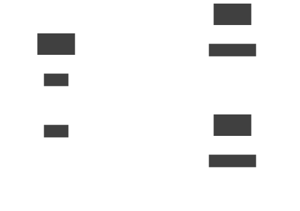
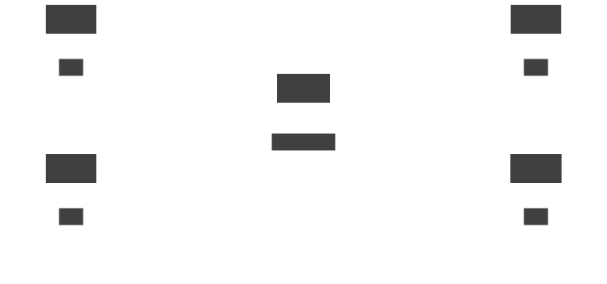

# Link concept

<section>

A _link_ is a channel for communication between sites.  Links
serve as a transport for application connections and requests.
A set of linked sites constitutes a network.

</section>
