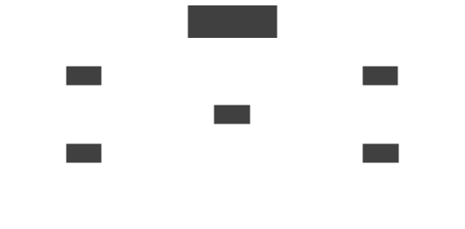

# Network concept

<section>

A _network_ is a set of linked sites. A Skupper network is also
known as an _application network_ or _virtual application
network_ (VAN).

Each network is meant for one distributed application.  This
provides isolation from other applications and networks.

</section>
