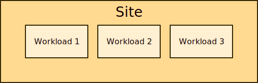

# Skupper concept overview

<figure>
  
  <figcaption>The primary concepts in the Skupper model</figcaption>
</figure>

## Sites

Skupper's job is to provide connectivity for applications that have
parts running in multiple locations and on different platforms.

A **[site](site.html)** represents a particular location and a
particular **[platform](platform.html)**.  It's a place where you have real running
workloads.  Each site corresponds to one platform namespace, so you
can have multiple sites on one platform.

<figure>
  
  <figcaption>A site with three workloads</figcaption>
</figure>

## Site linking

In a distributed application, those workloads need to communicate with
other workloads in other sites.  Skupper uses **[links](link.html)**
between sites to provide site-to-site communication.  Links are always
secured using mutual TLS authentication and encryption.

When a set of sites are linked, they function as one
application-focused **[network](network.html)**.  You typically use
short-lived **[access tokens](access-token.html)** to securely create
links.

<figure>
  
  <figcaption>A simple network with two sites</figcaption>
</figure>

## Service exposure

Site-to-site links are distinct from application connections.  Links
form the transport for your network. Application connections are
carried on top of this transport. Application connections can be
established in any direction and to any site, regardless of how the
underlying links are established.

Services are exposed on the network by creating corresponding
**[listeners](listener.html)** and **[connectors](connector.html)**.
A listener in one site provides a connection endpoint for client
workloads.  A connector in another site binds to local server
workloads.

The listener and connector are associated using a **[routing
key](routing-key.html)**.  Skupper routers use the routing key to
forward client connections to the sites where the server workload is
running.

<figure>
  
  <figcaption>A workload exposed as a service in a remote site</figcaption>
</figure>
