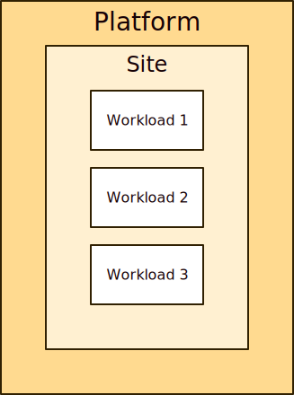
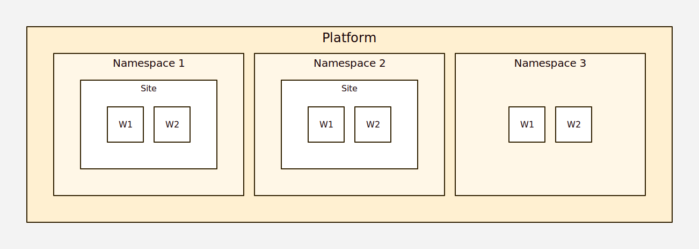

# Platform concept

<section>

A ***platform*** is a system for running workloads.  A platform
hosts sites.  Skupper supports Kubernetes, Docker, Podman, and
Linux.

Platforms provide ***namespaces*** for related workloads and
resources.  Skupper uses namespaces to host multiple independent
sites on one instance of a platform.

<figure>
  
  <figcaption>A simple network with sites on two different
  platforms</figcaption>
</figure>

<figure>
  
  <figcaption>A platform with three namespaces, two of which
  host Skupper sites</figcaption>
</figure>

</section>
