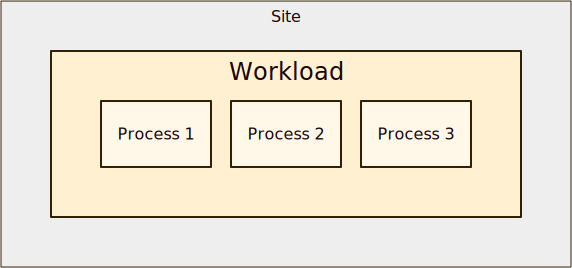

# Workload concept

<section>

A workload is a set of processes running at a [site](site.html).  A
process is a pod, container, or system process.

<figure>
  
  <figcaption>The workload model</figcaption>
</figure>

A site has zero or more workloads.  Each workload has zero or more
processes and zero or more [connectors](connector.html).

A workload implements one part of an application by providing a
network interface (for example, an API) that other parts of the
application use.  A workload can be both a client and a server.

On Kubernetes, a workload is a Deployment, StatefulSet, or
DaemonSet.  On Docker or Podman, a workload is a set of containers.
On Linux, a workload is a set of system processes.

<figure>
  
  <figcaption>A workload with three processes</figcaption>
</figure>

<figure>
  
  <figcaption>A workload exposed as a service using a
  connector</figcaption>
</figure>

</section>
